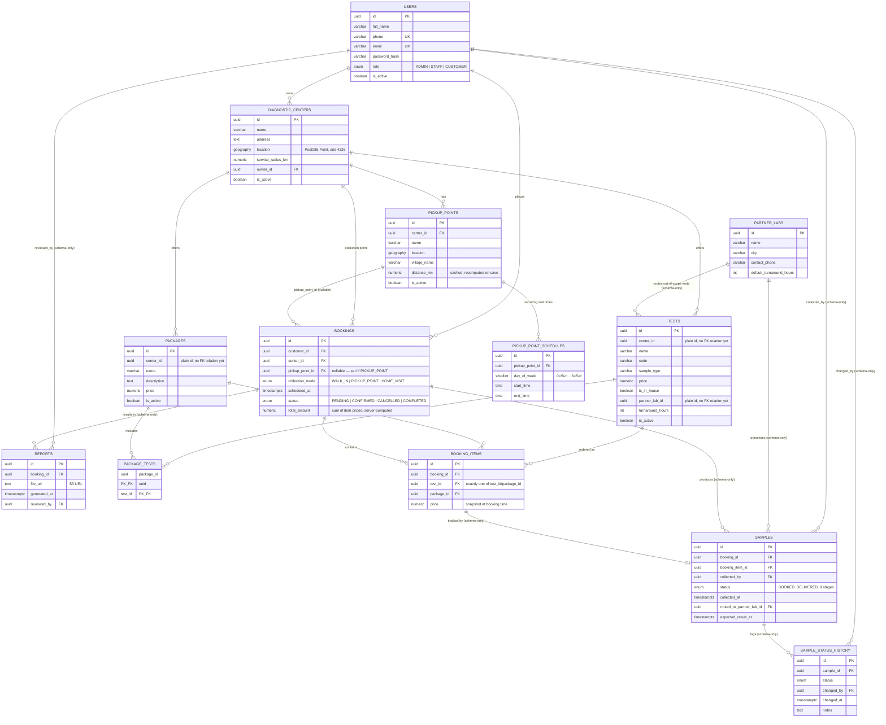

# Database ER diagram

Every table defined in [`schema.sql`](../schema.sql). Tables marked
**(entity)** already have a matching TypeORM entity in `apps/api/src`;
tables marked **(schema-only)** exist in the reference SQL but no module
has been built against them yet.

## Notes

- `location` columns are PostGIS `GEOGRAPHY(POINT, 4326)` — real-world
  lat/lng, which is what makes `ST_DWithin`/`ST_Distance` radius queries
  (used in the centers and pickup-points "nearby" search) work natively
  in the database rather than in application code.
- `tests.center_id` / `tests.partner_lab_id` / `packages.center_id` are
  plain UUID columns today, not TypeORM `@ManyToOne` relations — the
  `DiagnosticCenter` entity didn't exist yet when the catalog module was
  built. Wiring up the proper relation is a small follow-up once the
  catalog module is revisited.
- `booking_items` enforces "exactly one of `test_id`/`package_id`" with a
  DB-level `CHECK` constraint in `schema.sql`; the same rule is also
  validated in `BookingsService` before the row is even built.
