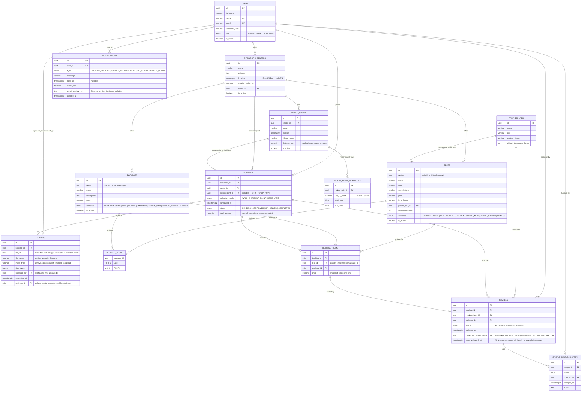

# Database ER diagram

Every table defined in [`schema.sql`](../schema.sql), plus `notifications`
(added in step 10, not part of the original reference SQL — see the note
at the bottom). Tables marked **(entity)** already have a matching
TypeORM entity in `apps/api/src`; tables marked **(schema-only)** exist
in the reference SQL but no module has been built against them yet. As
of step 10, every table in this diagram is an entity — `reports` was the
last schema-only one.

## Notes

- `location` columns are PostGIS `GEOGRAPHY(POINT, 4326)` — real-world
  lat/lng, which is what makes `ST_DWithin`/`ST_Distance` radius queries
  (used in the centers and pickup-points "nearby" search) work natively
  in the database rather than in application code.
- `tests.center_id` / `tests.partner_lab_id` / `packages.center_id` are
  plain UUID columns today, not TypeORM `@ManyToOne` relations — the
  `DiagnosticCenter` entity didn't exist yet when the catalog module was
  built. Wiring up the proper relation is a small follow-up once the
  catalog module is revisited.
- `booking_items` enforces "exactly one of `test_id`/`package_id`" with a
  DB-level `CHECK` constraint in `schema.sql`; the same rule is also
  validated in `BookingsService` before the row is even built.
- `tests.audience` / `packages.audience` back the customer web app's
  "shop by category" browsing (Men/Women/Children/Senior Men/Senior
  Women/Fitness) — set from the admin console's catalog forms, defaults
  to `EVERYONE` so untagged items keep showing up regardless of which
  category a customer browsed in from. Added after the initial catalog
  module shipped, not part of the original step-02 schema.
- `reports` finally got a real entity in step 10, extended past
  `schema.sql`'s original four columns with `file_name`/`mime_type`/
  `size_bytes`/`uploaded_by` — what an actual upload/download flow needs.
  `reviewed_by` is still just a column; no review workflow was built
  around it.
- `notifications` is entirely new in step 10 — not in `schema.sql` at
  all. See [`flows/11-notifications-reports-flow.md`](./11-notifications-reports-flow.md)
  for what writes to it and how email delivery (or its absence) is
  tracked on each row.
