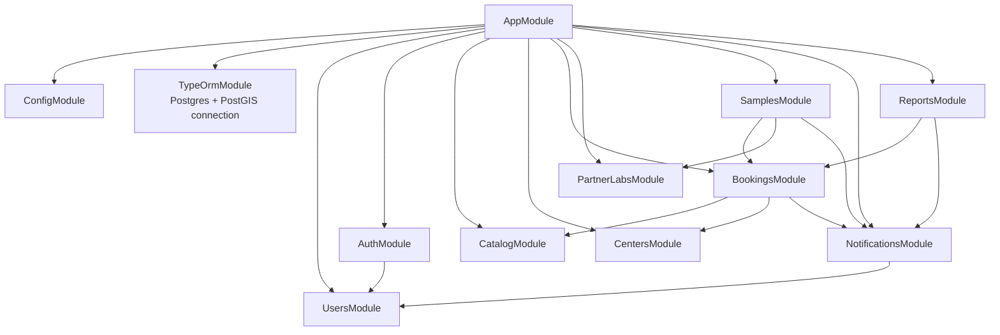

# Module dependency graph

Which NestJS module imports which. As of step 10, every module in
`ARCHITECTURE.md`'s build order is built — there's nothing left dashed.

## Why this matters

- **`AuthModule` imports `UsersModule`** — auth doesn't own user storage,
  it borrows `UsersService` to look up/create users, then issues tokens.
- **`BookingsModule` imports `CatalogModule` and `CentersModule`** — it
  never talks to their database tables directly. It calls
  `TestsService`, `PackagesService`, `CentersService`, and
  `PickupPointsService` (each module's exported providers) to validate
  IDs and fetch current prices. This is the pattern every cross-module
  dependency in this codebase follows: import the module, use its
  exported service, don't reach into its entities/repositories directly.
- **`SamplesModule` imports `BookingsModule`** (reuses
  `BookingsService.findOne()`/`findOneForUser()` rather than
  re-implementing "does this booking exist, does this user own it") **and
  `PartnerLabsModule`** (reuses `PartnerLabsService.findOne()` when
  routing a sample, and to compute the SLA target).
- **`Test.partnerLab` and `Sample.routedToPartnerLab` are `@ManyToOne`
  relations to `PartnerLab`, not module imports** — `CatalogModule`
  itself never imports `PartnerLabsModule`. TypeORM resolves the entity
  reference through `autoLoadEntities: true` in `app.module.ts`, no
  service dependency needed for that.
- Every module except `AppModule` itself also does
  `TypeOrmModule.forFeature([...])` internally to register its own
  entities' repositories — that's omitted from this diagram to keep it
  readable; see [`04-class-diagram-bookings.md`](./04-class-diagram-bookings.md)
  for how that looks at the class level for one module.
- **`NotificationsModule` only imports `UsersModule`** (to look up a
  recipient's email) — it never imports `BookingsModule` or
  `SamplesModule`. That's the opposite direction from what was originally
  sketched for this step (a dashed "planned" arrow pointing the other
  way): a shared, generic service like notifications sits *below* the
  domain modules that call into it, not above them. `BookingsModule` and
  `SamplesModule` import `NotificationsModule` and call
  `NotificationsService.notify()` at the couple of points that matter
  (booking created; sample collected; result ready) — same "import the
  module, call its exported service" pattern as everything else here.
- **`ReportsModule` imports both `BookingsModule` (for the
  owner-or-staff ownership check, same as `SamplesModule`) and
  `NotificationsModule`** (to notify the customer once a report lands).
