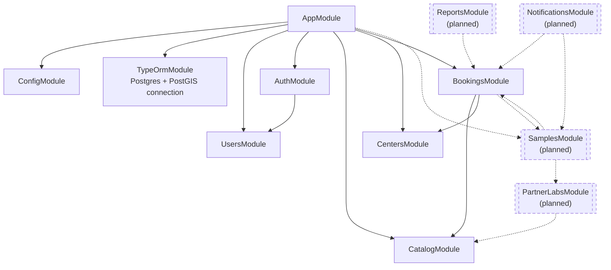

# Module dependency graph

Which NestJS module imports which. Solid boxes/arrows are built; dashed
ones are planned (from `ARCHITECTURE.md`'s build order) and not written
yet.

## Why this matters

- **`AuthModule` imports `UsersModule`** — auth doesn't own user storage,
  it borrows `UsersService` to look up/create users, then issues tokens.
- **`BookingsModule` imports `CatalogModule` and `CentersModule`** — it
  never talks to their database tables directly. It calls
  `TestsService`, `PackagesService`, `CentersService`, and
  `PickupPointsService` (each module's exported providers) to validate
  IDs and fetch current prices. This is the pattern every future
  cross-module dependency should follow: import the module, use its
  exported service, don't reach into its entities/repositories directly.
- Every module except `AppModule` itself also does
  `TypeOrmModule.forFeature([...])` internally to register its own
  entities' repositories — that's omitted from this diagram to keep it
  readable; see [`04-class-diagram-bookings.md`](./04-class-diagram-bookings.md)
  for how that looks at the class level for one module.
