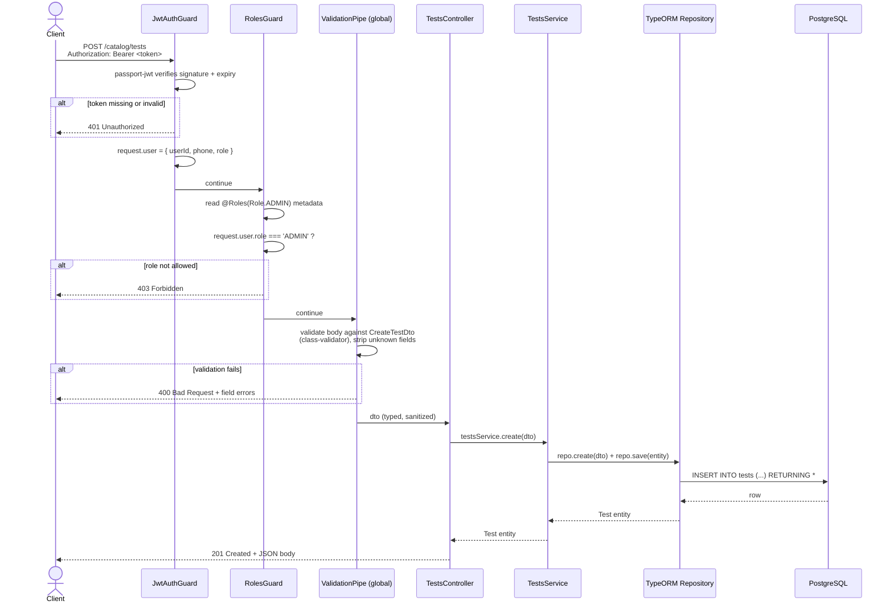

# Request lifecycle (generic, shown with a real endpoint)

Every HTTP request into the API passes through the same layers in the
same order. This is shown concretely using `POST /catalog/tests`
(create a test) because it's the one endpoint pattern that exercises
every layer, including both guards — most endpoints use a subset of
this (e.g. a public `GET` skips both guards entirely).

## The same pipeline, simplified per endpoint type

| Endpoint type | Guards run? | Example |
|---|---|---|
| Public read | none | `GET /catalog/tests` |
| Any logged-in user | `JwtAuthGuard` only | `POST /bookings`, `GET /bookings/mine` |
| Role-restricted | `JwtAuthGuard` + `RolesGuard` | `POST /catalog/tests`, `PATCH /bookings/:id/status` |

`ValidationPipe` is registered once, globally, in `main.ts`
(`app.useGlobalPipes(new ValidationPipe({ whitelist: true, transform: true }))`)
— every controller gets it automatically; no per-route wiring needed.

`RolesGuard` (see `common/guards/roles.guard.ts`) is permissive by
default: a route with **no** `@Roles(...)` decorator is open to any
authenticated user once `JwtAuthGuard` has run. It only restricts a
route once `@Roles(...)` is explicitly attached.
