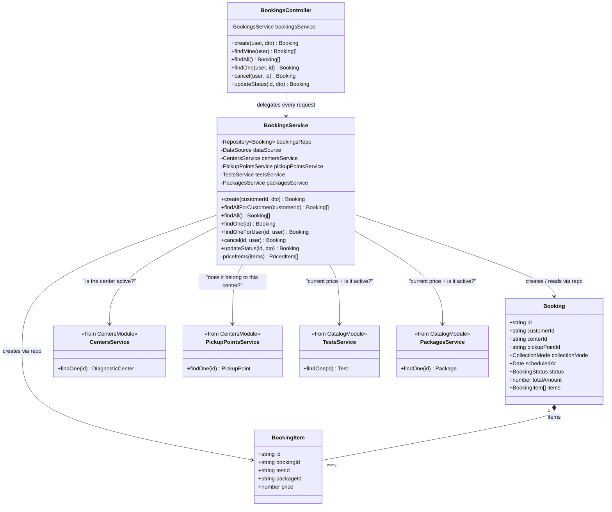

# Class diagram — Bookings module

Every module in this codebase (Users, Catalog, Centers, Bookings) follows
the same shape: **Controller → Service → Entity**, with the Service being
the only class that touches the database (via an injected TypeORM
`Repository`). Bookings is shown here specifically because it's the only
module so far that also depends on *other* modules' services, which is
the pattern any future cross-module feature (samples, partner-lab
routing, reports) will repeat.

## Reading this for the other modules

Swap in the equivalent names and the diagram describes Catalog and
Centers too:

- **Catalog**: `TestsController`/`PackagesController` →
  `TestsService`/`PackagesService` → `Test`/`Package` entities. No
  cross-module dependencies.
- **Centers**: `CentersController`/`PickupPointsController` →
  `CentersService`/`PickupPointsService` →
  `DiagnosticCenter`/`PickupPoint`/`PickupPointSchedule` entities. No
  cross-module dependencies.
- **Users**: `UsersService` → `User` entity, with no controller of its
  own — it's only ever used internally by `AuthModule`.
