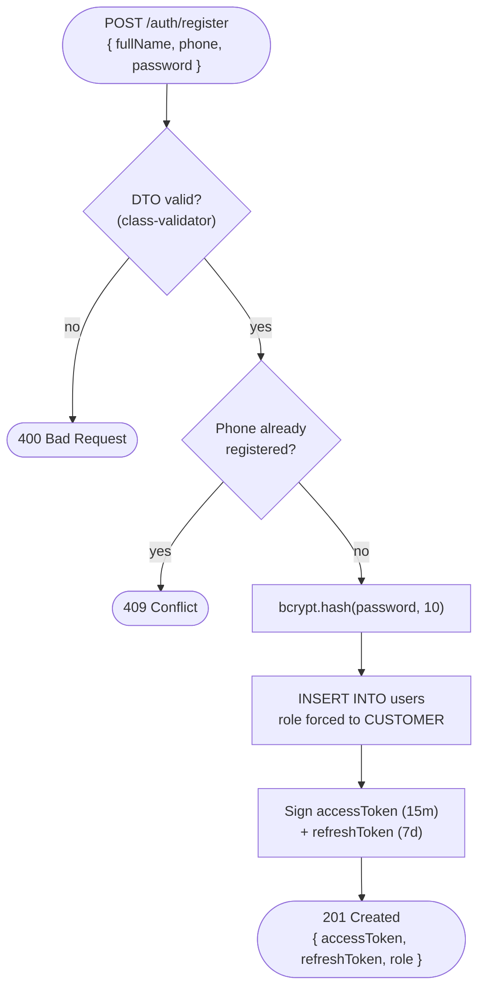
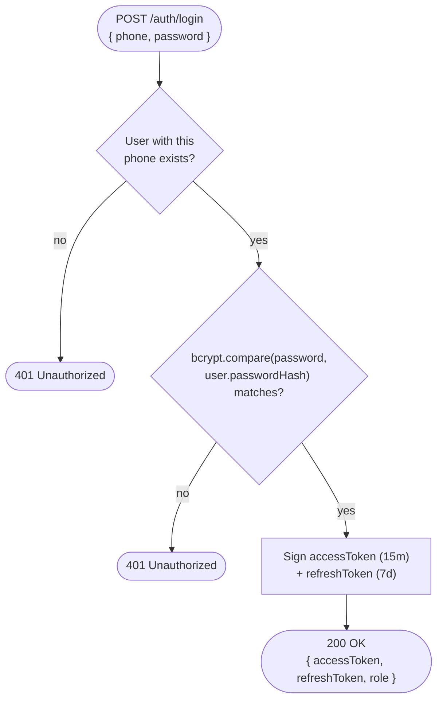
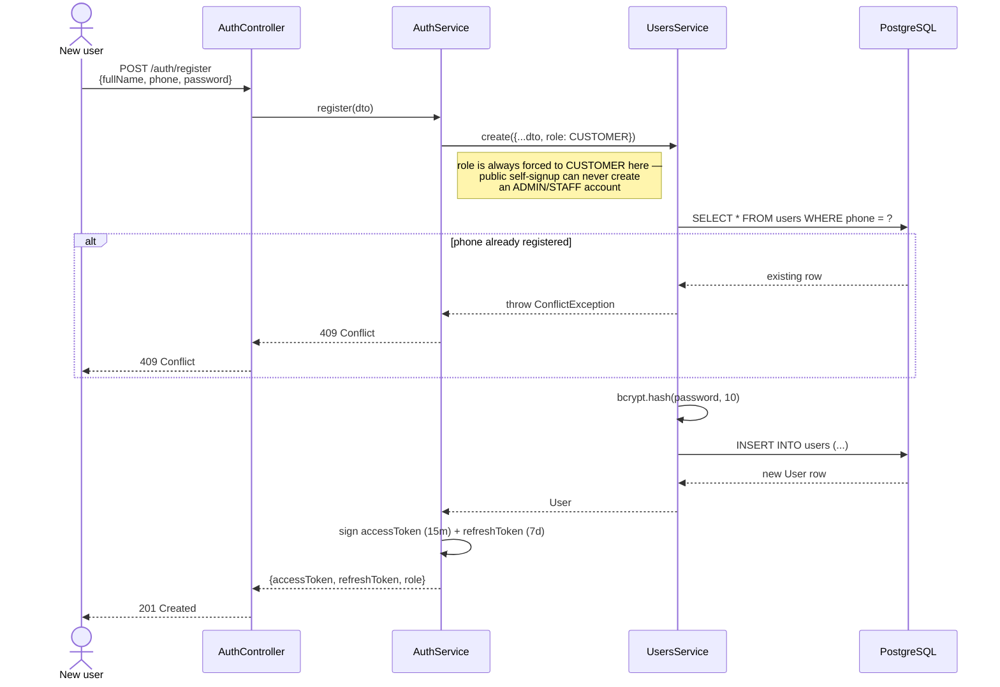
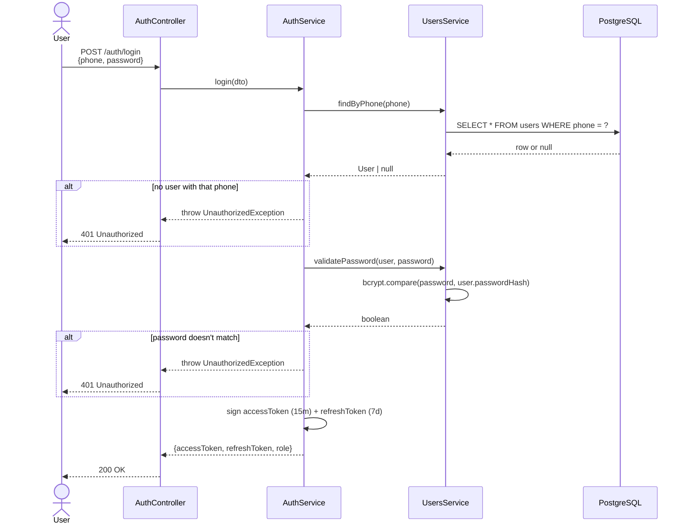
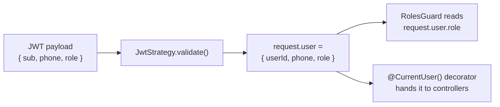

# Auth flow — register, login, and every request after that

**Pairs with:** [`flows/drawio/01-auth-trace.drawio`](./drawio/01-auth-trace.drawio)

## Objective

Let anyone create an account and log in, and issue a token every other
protected endpoint in the API can trust **without querying the database
again**. Public self-signup must never be able to create anything other
than a `CUSTOMER` account.

## Classes / entities / DTOs used

| Layer | Name | Role |
|---|---|---|
| Controller | `AuthController` | `POST /auth/register`, `POST /auth/login` |
| Service | `AuthService` | signs the JWTs; delegates user lookup/creation to `UsersService` |
| Service (borrowed) | `UsersService` | owns the `users` table — `AuthModule` imports `UsersModule` rather than touching it directly (see [`02-module-dependency-graph.md`](./02-module-dependency-graph.md)) |
| DTO | `RegisterDto` | `fullName`, `phone`, `email?`, `password` — validated by `class-validator` before the controller runs |
| DTO | `LoginDto` | `phone`, `password` |
| Entity | `User` | `@Entity('users')` |
| Guard/Strategy | `JwtStrategy` (`passport-jwt`) | verifies every protected request afterwards (see below) |

## Tables used

| Table | Operations |
|---|---|
| `users` | `SELECT ... WHERE phone = ?` (both register's duplicate check and login's lookup) · `INSERT` (register only) |

No other table is touched by auth — login/register never join anything.

## Conditions checked

| # | Condition | Outcome |
|---|---|---|
| 1 | Register: phone already exists in `users` | `409 Conflict` |
| 2 | Register: role field is **always overwritten to `CUSTOMER`**, whatever the request sends | not a rejection — a hard invariant; there is no way to self-register as `ADMIN`/`STAFF` (see "Known gaps" below) |
| 3 | Login: no user with that phone | `401 Unauthorized` |
| 4 | Login: `bcrypt.compare(password, user.passwordHash)` fails | `401 Unauthorized` |
| 5 | Every later request: `JwtAuthGuard` finds an invalid/expired/missing token | `401 Unauthorized` (this happens on *every* protected route, not just auth's own — it's the mechanism, not a business rule) |

Passwords are hashed with `bcrypt.hash(password, 10)` before the `INSERT` —
the plaintext password never reaches the `users` table.

## How it flows

### Register — start to end

### Login — start to end

## Sequence detail (which service calls which)

The flowcharts above are the actual decision path; these sequence
diagrams add which service/table each step actually calls, if you want
that detail too.

### Register

### Login

### Every request after that

The client sends `Authorization: Bearer <accessToken>` on protected
routes. `JwtStrategy` verifies the signature and expiry, then decodes the
payload into `request.user` — no second database round-trip:

Authorization is a pure in-memory check against the decoded token until
the access token expires (15 minutes) and the client needs the refresh
token to get a new one.

## Known gaps (worth knowing when reading this)

- **No self-service path to `ADMIN`/`STAFF`.** Every admin/staff account
  in this system today was promoted directly in the database
  (`UPDATE users SET role = 'ADMIN' ...`) — see `apps/admin-web/README.md`.
  There's no endpoint or seed script for it yet.
- **No refresh-token endpoint exists in the API.** `AuthService` signs a
  `refreshToken` on every register/login, but there's no
  `POST /auth/refresh` (or similar) that redeems it yet — clients hold a
  refresh token they currently have no way to use. Worth flagging as a
  real follow-up, not by-design.
