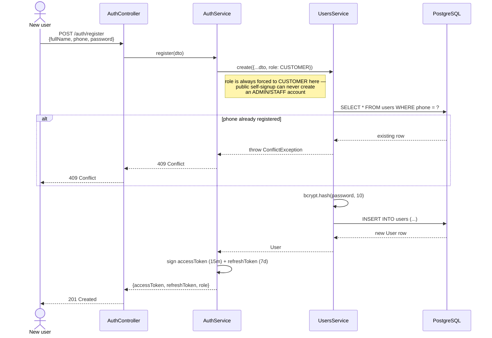
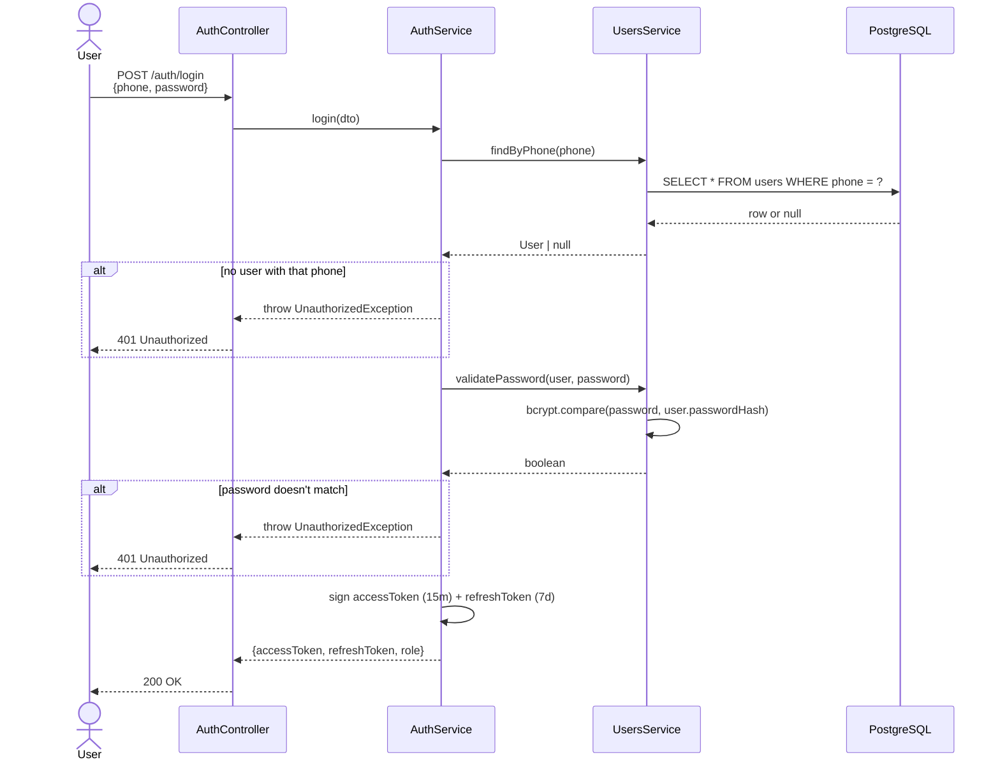
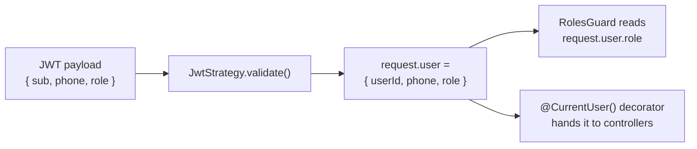

# Auth flow — register, login, and every request after that

## Register

## Login

## Every request after that

The client sends `Authorization: Bearer <accessToken>` on protected
routes. `JwtStrategy` (`passport-jwt`) verifies the signature and
expiry, then decodes the payload into `request.user`:

Nothing queries the database again on every request — the JWT itself
carries `userId`/`phone`/`role`, so authorization is a pure in-memory
check against the decoded token until the access token expires (15
minutes) and the client needs to use the refresh token to get a new one.
