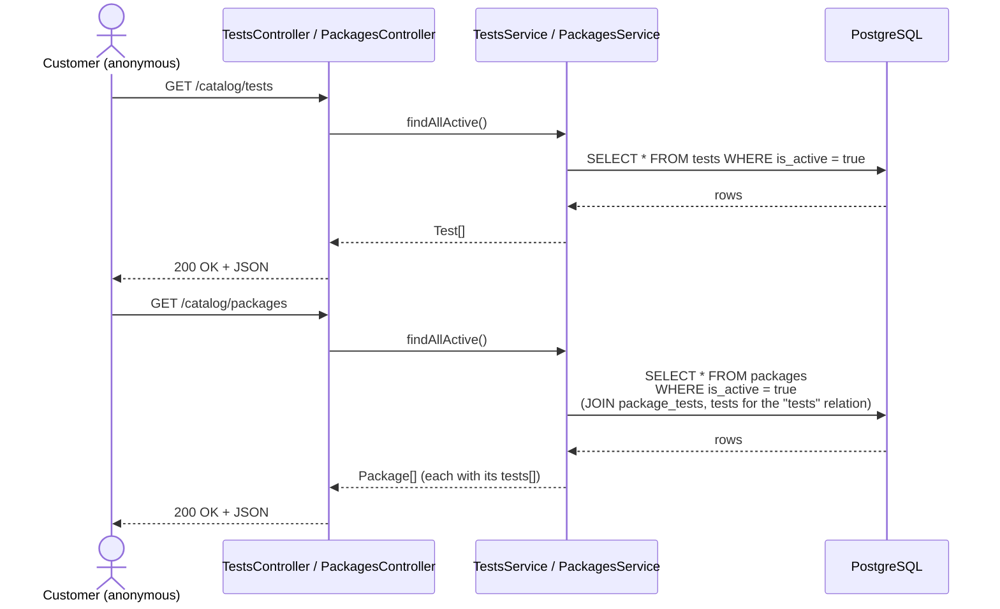
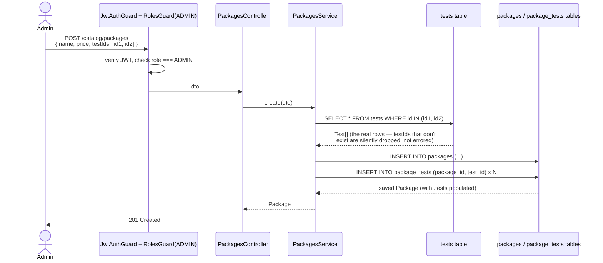
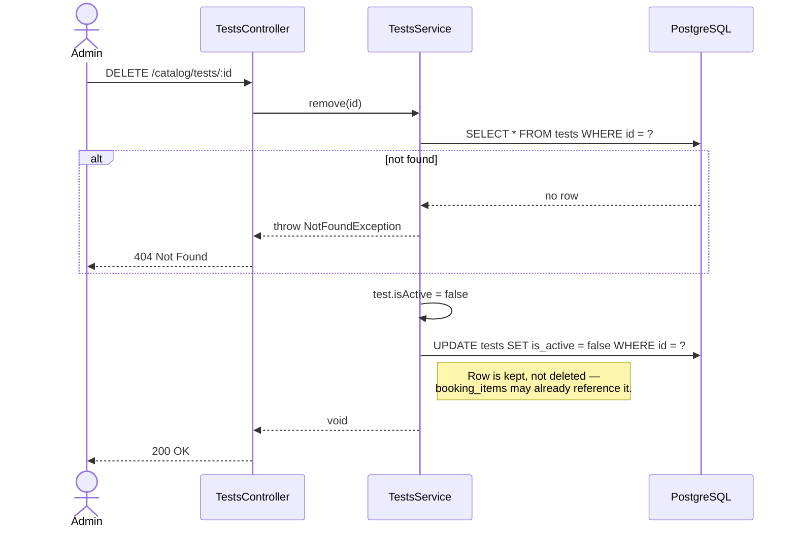

# Catalog flow — browsing, and an admin managing tests/packages

**Pairs with:** [`flows/drawio/02-catalog-trace.drawio`](./drawio/02-catalog-trace.drawio)

## Objective

Let anyone browse the live test/package catalog (no login needed), and
let an `ADMIN` create/edit/retire tests and build packages out of
existing tests — never returning a deactivated item to a public browse.

## Classes / entities / DTOs used

| Layer | Name | Role |
|---|---|---|
| Controller | `TestsController` | `GET/POST/PATCH/DELETE /catalog/tests` |
| Controller | `PackagesController` | `GET/POST/PATCH/DELETE /catalog/packages` |
| Service | `TestsService` | one table, straightforward CRUD + soft delete |
| Service | `PackagesService` | resolves `testIds[]` into real `Test` rows when building/editing a package |
| DTO | `CreateTestDto` / `UpdateTestDto` (`PartialType`) | includes `audience` (optional, defaults `EVERYONE` — see `flows/01-database-erd.md`) |
| DTO | `CreatePackageDto` / `UpdatePackageDto` | `CreatePackageDto` carries `testIds: string[]` |
| Entity | `Test` | `@Entity('tests')` |
| Entity | `Package` | `@Entity('packages')`, `@ManyToMany` to `Test` via `package_tests` |
| Guard | `JwtAuthGuard` + `RolesGuard(ADMIN)` | every write route; reads are public |

## Tables used

| Table | Operations |
|---|---|
| `tests` | `SELECT` (public browse, filtered `is_active`) · `INSERT` · `UPDATE` (edits, and soft delete via `is_active = false`) |
| `packages` | `SELECT` (with `relations: ['tests']`) · `INSERT` · `UPDATE` / soft delete |
| `package_tests` | join-table rows written whenever a package's `testIds` are set (create or update) |

## Conditions checked

| # | Condition | Outcome |
|---|---|---|
| 1 | Public `GET` routes only ever return `is_active = true` rows | deactivated items are invisible to browsing, with no "show inactive" toggle anywhere (admin included) |
| 2 | `PackagesService.create()`: an id in `testIds` that doesn't match a real row | **silently dropped**, not an error — the package is created with whatever subset of ids actually resolved. Worth double-checking a package's returned `tests[]` length matches what you sent. |
| 3 | `DELETE /catalog/tests/:id` (and packages): id not found | `404 Not Found` |
| 4 | Delete is **always a soft delete** (`is_active = false`) | the row is kept, never removed — `booking_items` may already reference it, so a hard delete would break booking history |

## How it flows

### Public browse (no login needed)

### Admin creates a package from existing tests

### Admin removes a test (soft delete)

