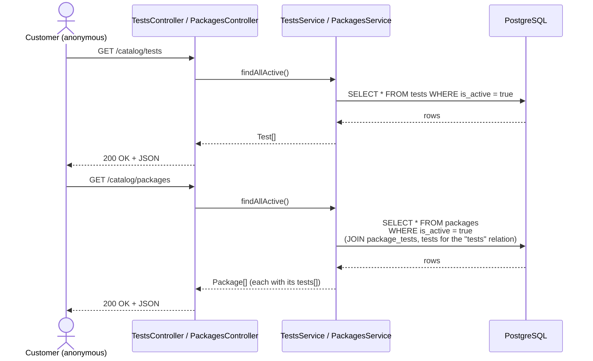
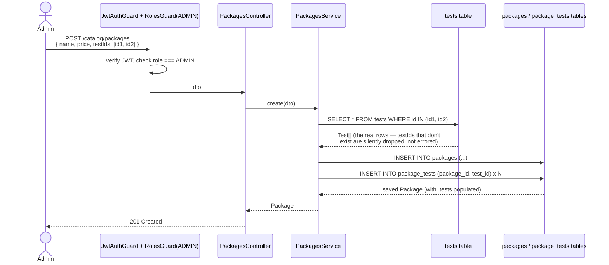
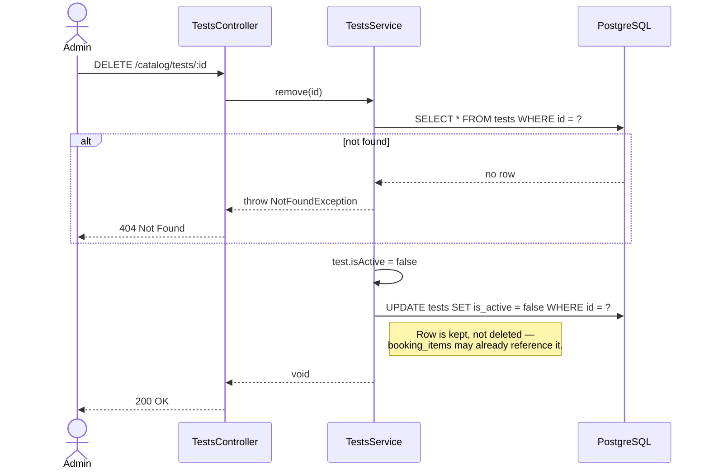

# Catalog flow — browsing, and an admin adding a package

## Public browse (no login needed)

```mermaid
sequenceDiagram
    actor C as Customer (anonymous)
    participant Ctrl as TestsController / PackagesController
    participant Svc as TestsService / PackagesService
    participant DB as PostgreSQL

    C->>Ctrl: GET /catalog/tests
    Ctrl->>Svc: findAllActive()
    Svc->>DB: SELECT * FROM tests WHERE is_active = true
    DB-->>Svc: rows
    Svc-->>Ctrl: Test[]
    Ctrl-->>C: 200 OK + JSON

    C->>Ctrl: GET /catalog/packages
    Ctrl->>Svc: findAllActive()
    Svc->>DB: SELECT * FROM packages<br/>WHERE is_active = true<br/>(JOIN package_tests, tests for the "tests" relation)
    DB-->>Svc: rows
    Svc-->>Ctrl: Package[] (each with its tests[])
    Ctrl-->>C: 200 OK + JSON
```

## Admin creates a package from existing tests

```mermaid
sequenceDiagram
    actor A as Admin
    participant G as JwtAuthGuard + RolesGuard(ADMIN)
    participant Ctrl as PackagesController
    participant Svc as PackagesService
    participant TestsRepo as tests table
    participant PkgRepo as packages / package_tests tables

    A->>G: POST /catalog/packages<br/>{ name, price, testIds: [id1, id2] }
    G->>G: verify JWT, check role === ADMIN
    G->>Ctrl: dto
    Ctrl->>Svc: create(dto)
    Svc->>TestsRepo: SELECT * FROM tests WHERE id IN (id1, id2)
    TestsRepo-->>Svc: Test[] (the real rows — testIds that don't<br/>exist are silently dropped, not errored)
    Svc->>PkgRepo: INSERT INTO packages (...)
    Svc->>PkgRepo: INSERT INTO package_tests (package_id, test_id) x N
    PkgRepo-->>Svc: saved Package (with .tests populated)
    Svc-->>Ctrl: Package
    Ctrl-->>A: 201 Created
```

## Admin removes a test (soft delete)

```mermaid
sequenceDiagram
    actor A as Admin
    participant Ctrl as TestsController
    participant Svc as TestsService
    participant DB as PostgreSQL

    A->>Ctrl: DELETE /catalog/tests/:id
    Ctrl->>Svc: remove(id)
    Svc->>DB: SELECT * FROM tests WHERE id = ?
    alt not found
        DB-->>Svc: no row
        Svc-->>Ctrl: throw NotFoundException
        Ctrl-->>A: 404 Not Found
    end
    Svc->>Svc: test.isActive = false
    Svc->>DB: UPDATE tests SET is_active = false WHERE id = ?
    Note right of Svc: Row is kept, not deleted —<br/>booking_items may already reference it.
    Svc-->>Ctrl: void
    Ctrl-->>A: 200 OK
```
