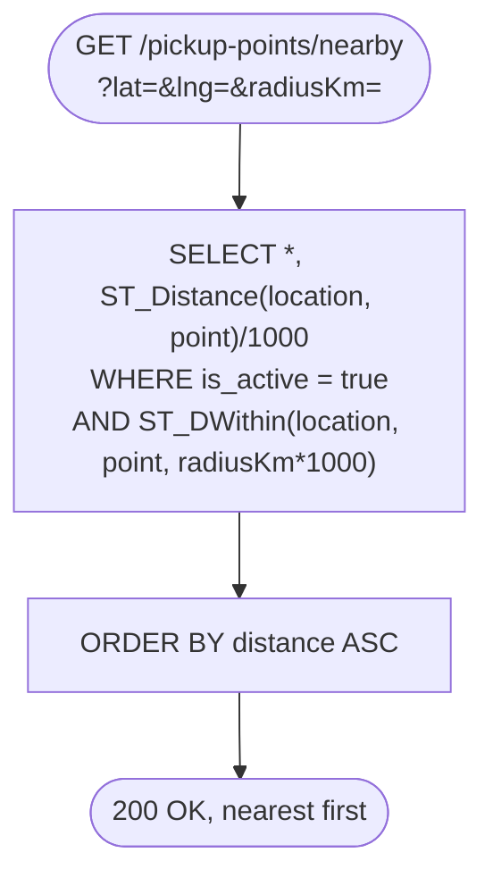
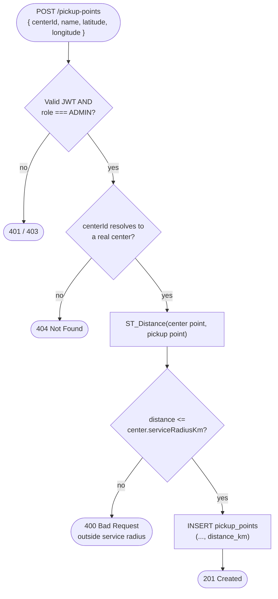
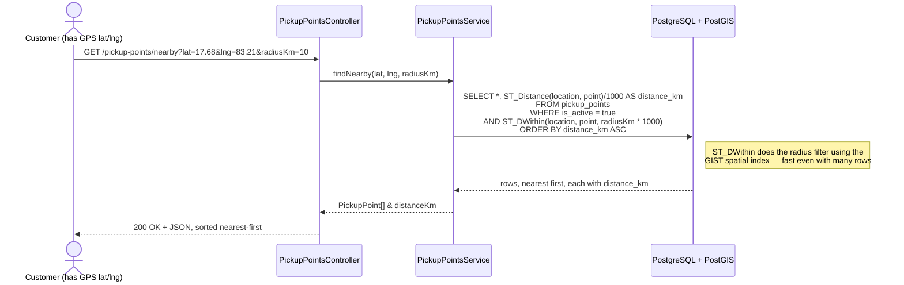
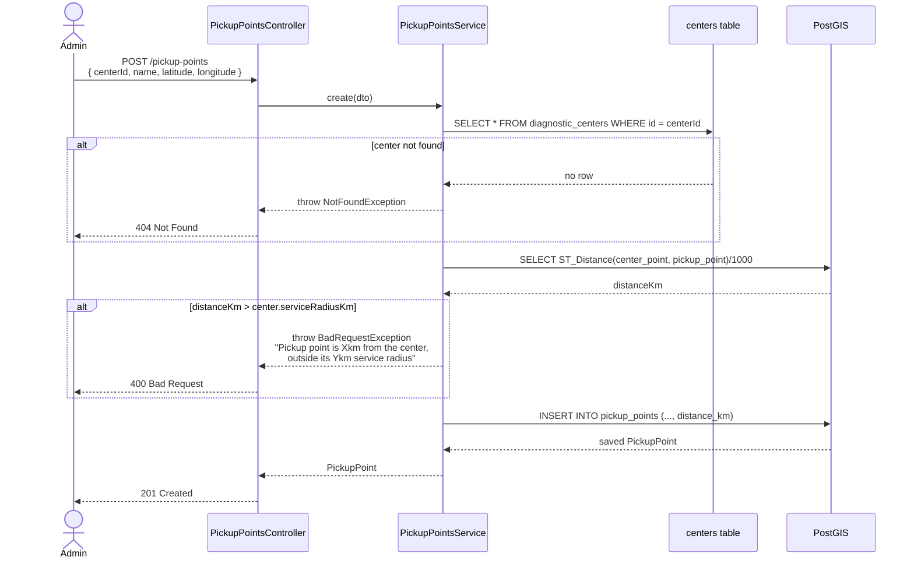

# Centers & pickup points flow — "find near me" and radius validation

**Pairs with:** [`flows/drawio/03-centers-trace.drawio`](./drawio/03-centers-trace.drawio)
and [`flows/drawio/04-pickup-points-trace.drawio`](./drawio/04-pickup-points-trace.drawio)
(this one doc covers both — they're the same feature from two sides).

## Objective

Let a customer find the nearest pickup point by GPS, and let an admin
register centers and pickup points such that a pickup point can **never**
be saved outside its center's declared service radius — checked with real
geography, not client-trusted math.

One structural note: despite the separate controller/service classes
below, centers and pickup points are **one NestJS module**
(`CentersModule`, `apps/api/src/centers/`) — `ARCHITECTURE.md` lists them
as if they were two, but `pickup-points.controller.ts`/`.service.ts` live
alongside the centers files in the same folder, not a sibling
`pickup-points/` module.

## Classes / entities / DTOs used

| Layer | Name | Role |
|---|---|---|
| Controller | `CentersController` | `GET /centers`, `GET /centers/nearby`, admin CRUD |
| Controller | `PickupPointsController` | `GET /pickup-points`, `GET /pickup-points/nearby`, admin CRUD, `POST /pickup-points/:id/schedules` |
| Service | `CentersService` | owns `diagnostic_centers` |
| Service | `PickupPointsService` | owns `pickup_points` + `pickup_point_schedules`; calls into `CentersService` to validate the radius |
| DTO | `CreateCenterDto` | `name`, `address`, `latitude`/`longitude` → stored as a PostGIS `GEOGRAPHY(POINT)` |
| DTO | `CreatePickupPointDto` | `centerId`, `name`, `latitude`/`longitude`, `villageName?` |
| DTO | `NearbyQueryDto` | `lat`, `lng`, `radiusKm?` (query params) |
| Entity | `DiagnosticCenter` | `@Entity('diagnostic_centers')` |
| Entity | `PickupPoint` | `@Entity('pickup_points')` |
| Entity | `PickupPointSchedule` | `@Entity('pickup_point_schedules')` — recurring visit times, day of week + start/end time |

## Tables used

| Table | Operations |
|---|---|
| `diagnostic_centers` | `SELECT` (public list/nearby, and the lookup a pickup-point create validates against) · `INSERT`/`UPDATE` (admin) |
| `pickup_points` | `SELECT` with `ST_Distance`/`ST_DWithin` (nearby search) · `INSERT` with `distance_km` precomputed · `UPDATE` (admin) |
| `pickup_point_schedules` | `INSERT` (`POST /pickup-points/:id/schedules`) |

## Conditions checked

| # | Condition | Outcome |
|---|---|---|
| 1 | Nearby search: `is_active = true` and `ST_DWithin(location, point, radiusKm * 1000)` | matching rows only, sorted nearest-first by `ST_Distance` |
| 2 | Pickup point create: `centerId` doesn't resolve to a real center | `404 Not Found` |
| 3 | Pickup point create: real-world distance from center > `center.serviceRadiusKm` | `400 Bad Request` ("Pickup point is Xkm from the center, outside its Ykm service radius") — **the distance is recomputed in PostGIS from the submitted lat/lng, never trusted from the client** |

The same "recompute, don't trust client math" pattern reappears in the
booking flow for prices — see [`08-booking-flow.md`](./08-booking-flow.md).

## How it flows

### Nearby search — start to end

### Admin adds a pickup point — start to end

## Sequence detail (which service calls which)

### Nearby search (customer finding a pickup point)

### Admin adds a pickup point — radius validation

