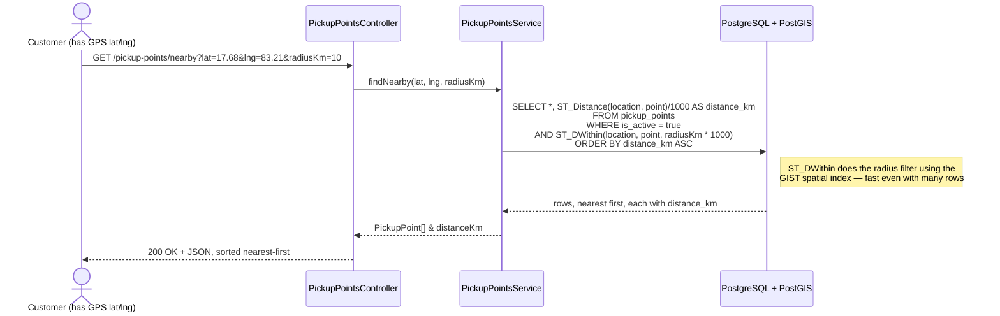
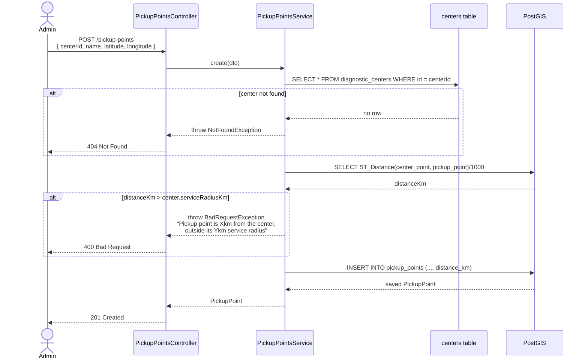

# Centers & pickup points flow — "find near me" and radius validation

## Nearby search (customer finding a pickup point)

## Admin adds a pickup point — radius validation

## Why this matters

The distance check is never trusted to the client — a customer's phone
or an admin's form could send any `latitude`/`longitude`, so the API
always recomputes the real distance in PostGIS (`ST_Distance` on
`geography` columns, which accounts for the Earth's curvature) before
accepting or rejecting the write. The same pattern — **recompute,
don't trust** — shows up again in the booking flow for prices; see
[`08-booking-flow.md`](./08-booking-flow.md).
