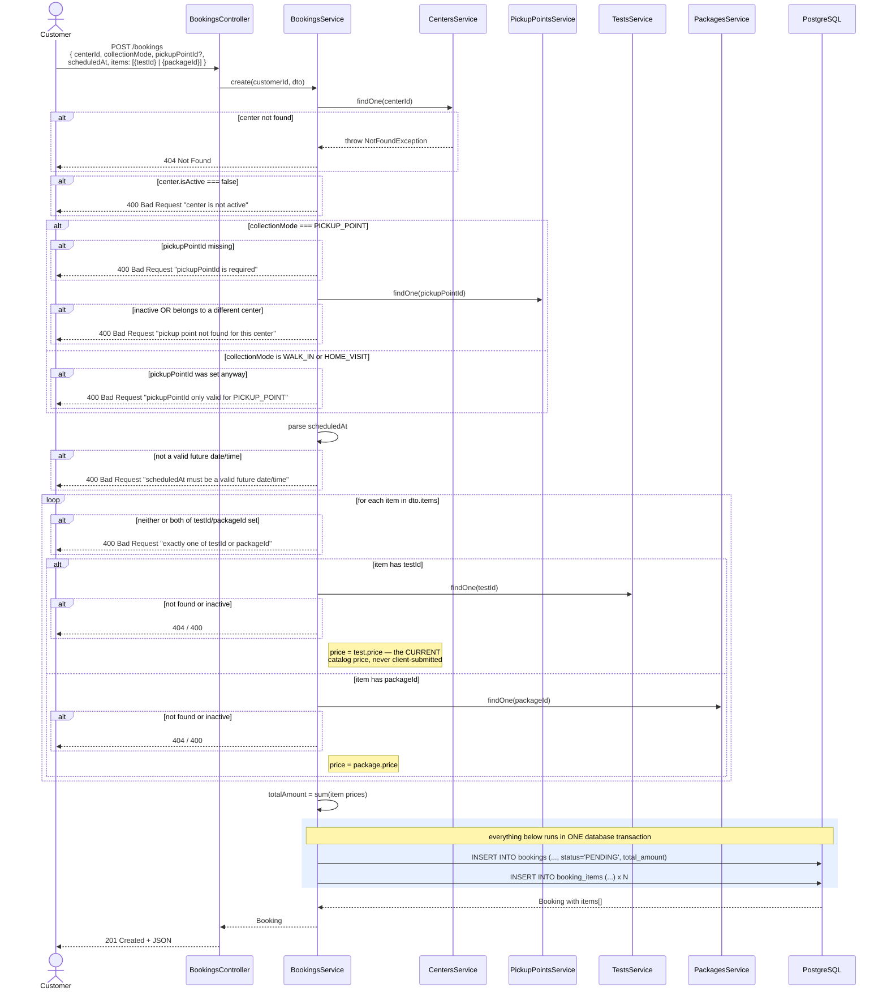

# Booking flow — every validation step, in order

This is the most involved flow in the codebase — it's the one place
where Bookings, Catalog, and Centers all meet. Every rejection point
below is a real `alt` branch in `BookingsService.create()`.

## After creation

Cancelling is only allowed from `PENDING` or `CONFIRMED` — a
`COMPLETED` or already-`CANCELLED` booking rejects further cancellation
with `400 Bad Request`. The next step in the build order (sample
lifecycle) will hang its own, more granular status chain
(`BOOKED → COLLECTED → ... → DELIVERED`) off of each `booking_item`,
separate from this booking-level status.
