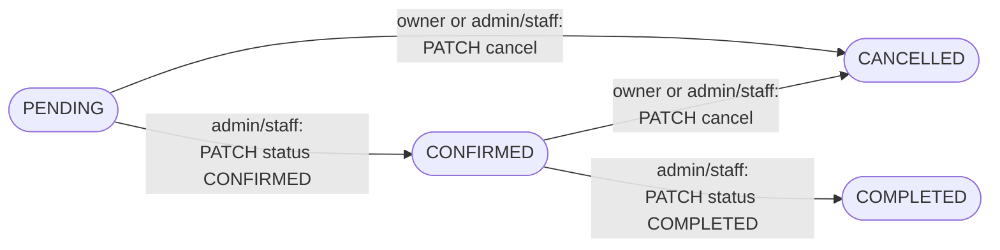
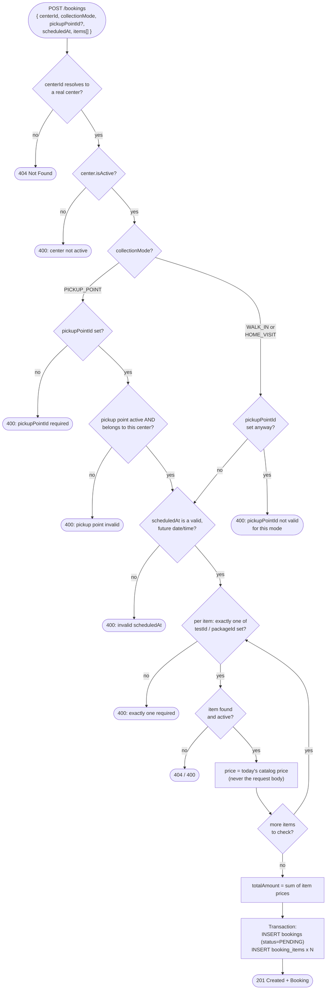
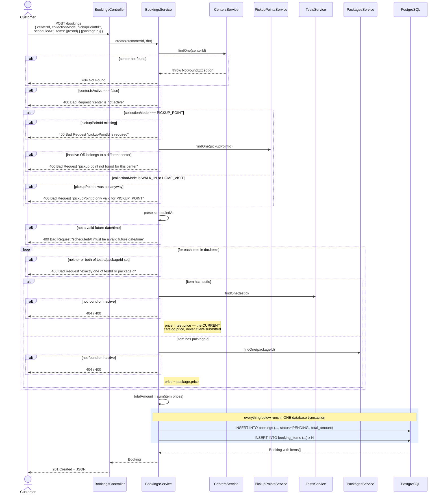

# Booking flow — every validation step, in order

**Pairs with:** [`flows/drawio/05-bookings-trace.drawio`](./drawio/05-bookings-trace.drawio)

## Objective

Create a booking that validates and prices itself entirely from **live
server data** — never a client-submitted price, and never an assumed
relationship between center/pickup point/items — then write the booking
and all its items in one atomic transaction. This is the one place in
the codebase where Bookings, Catalog, and Centers all meet.

## Classes / entities / DTOs used

| Layer | Name | Role |
|---|---|---|
| Controller | `BookingsController` | `POST /bookings`, `GET /bookings`, `GET /bookings/mine`, `GET /bookings/:id`, `PATCH /bookings/:id/cancel`, `PATCH /bookings/:id/status` |
| Service | `BookingsService` | orchestrates — calls `CentersService`, `PickupPointsService`, `TestsService`, `PackagesService` (imports their modules, never touches their tables directly) |
| DTO | `CreateBookingDto` | `centerId`, `collectionMode`, `pickupPointId?`, `scheduledAt`, `items: [{testId} \| {packageId}]` |
| Entity | `Booking` | `@Entity('bookings')` |
| Entity | `BookingItem` | `@Entity('booking_items')`, exactly one of `testId`/`packageId` set |

## Tables used

| Table | Operations |
|---|---|
| `diagnostic_centers` | `SELECT` (read-only validation lookup) |
| `pickup_points` | `SELECT` (read-only validation lookup, only if `collectionMode = PICKUP_POINT`) |
| `tests` | `SELECT` per item that has a `testId` |
| `packages` | `SELECT` per item that has a `packageId` |
| `bookings` | `INSERT` |
| `booking_items` | `INSERT` × N (one per item), same transaction as the `bookings` insert |

## Conditions checked

Every row below is a real `alt` branch in `BookingsService.create()` — in
this order:

| # | Condition | Outcome |
|---|---|---|
| 1 | `centerId` doesn't resolve to a real center | `404 Not Found` |
| 2 | Center exists but `isActive === false` | `400 Bad Request` |
| 3 | `collectionMode === PICKUP_POINT` but `pickupPointId` missing | `400 Bad Request` |
| 4 | `pickupPointId` set but inactive, or belongs to a **different** center than `centerId` | `400 Bad Request` |
| 5 | `collectionMode` is `WALK_IN`/`HOME_VISIT` but `pickupPointId` was sent anyway | `400 Bad Request` |
| 6 | `scheduledAt` isn't a valid, **future** date/time | `400 Bad Request` |
| 7 | Per item: neither or **both** of `testId`/`packageId` set | `400 Bad Request` |
| 8 | Item's `testId`/`packageId` not found, or found but inactive | `404` / `400` |
| 9 | Price for every item is read from **today's catalog row**, never the request body | not a rejection — the pricing invariant the whole flow exists to protect |
| 10 | Everything from the `bookings` insert onward runs in **one DB transaction** | either the booking + all its items are saved, or none of them are |

### After creation — booking-level status

Cancelling is only allowed from `PENDING` or `CONFIRMED` — a `COMPLETED`
or already-`CANCELLED` booking rejects further cancellation with
`400 Bad Request`. This is a **separate, coarser** status chain from each
sample's own lifecycle — see [`09-sample-lifecycle-flow.md`](./09-sample-lifecycle-flow.md).

## How it flows — start to end

## Sequence detail (which service calls which)

