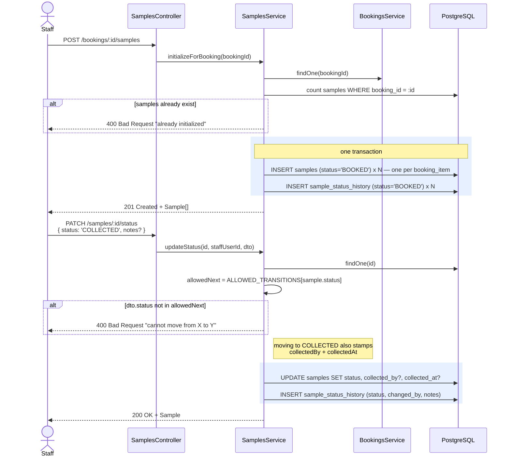

# Sample lifecycle — the physical specimen's own status chain

Separate from the booking's own status (`PENDING → CONFIRMED → COMPLETED`,
see [`08-booking-flow.md`](./08-booking-flow.md)), each **sample** — one
per booking item — moves through a longer, stricter chain that mirrors
what actually happens to the physical specimen.

`AT_CENTER` is the only fork — everything else is a strict, one-way
chain. `SamplesService.updateStatus()` enforces this with a lookup table
(`ALLOWED_TRANSITIONS`); any status change not shown by an arrow above is
rejected with `400 Bad Request`, whatever role is asking.

## Initializing + advancing a sample

## Who can see what

| Route | Who |
|---|---|
| `POST /bookings/:id/samples` | `ADMIN` / `STAFF` only |
| `GET /bookings/:id/samples` | the booking's owner, or `ADMIN` / `STAFF` |
| `PATCH /samples/:id/status` | `ADMIN` / `STAFF` only |
| `GET /samples/:id/history` | the booking's owner, or `ADMIN` / `STAFF` |

The owner-or-staff check is not reimplemented here — `SamplesService`
calls straight into `BookingsService.findOneForUser()`, the same check
`GET /bookings/:id` already uses, so there's exactly one place that rule
lives.
