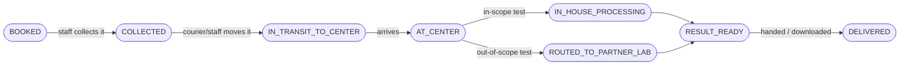
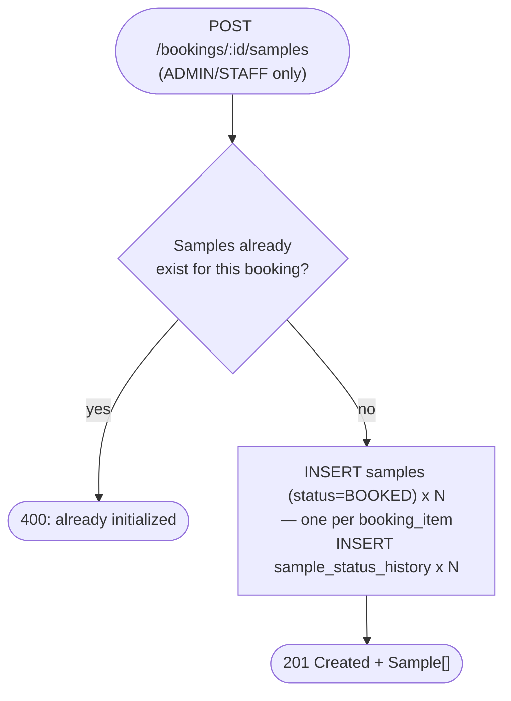
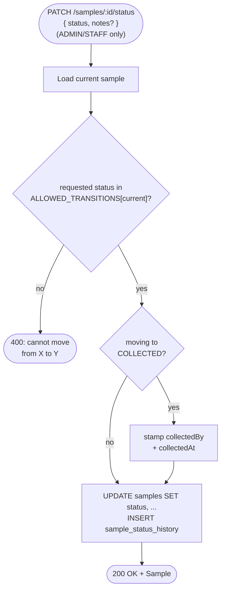
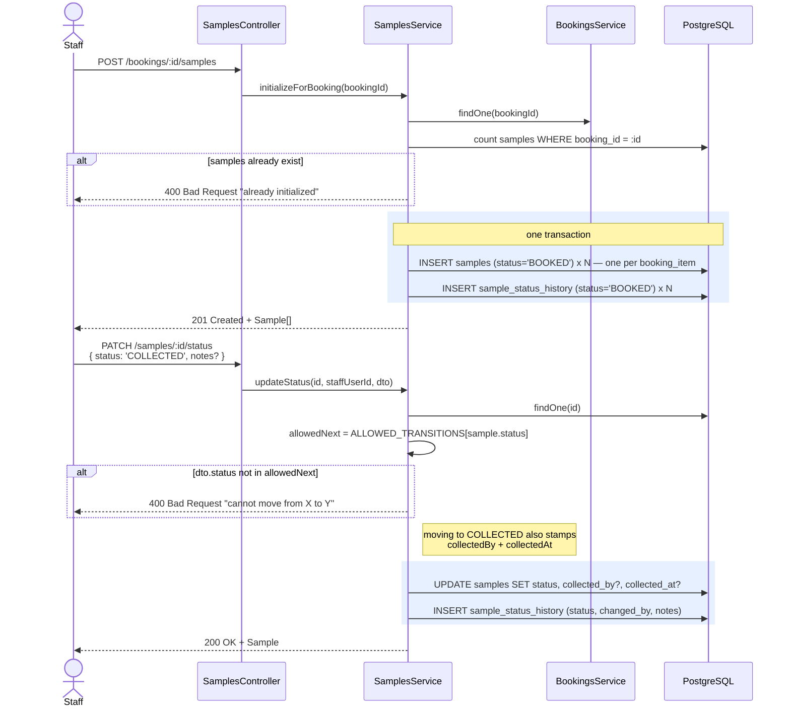

# Sample lifecycle — the physical specimen's own status chain

**Pairs with:** [`flows/drawio/07-samples-trace.drawio`](./drawio/07-samples-trace.drawio)

## Objective

Track each physical sample — one per booking item — through a strict,
mostly one-way status chain that mirrors what actually happens to the
specimen (collected → transported → processed → delivered), completely
separate from the booking's own coarser status
(`PENDING → CONFIRMED → COMPLETED`, see
[`08-booking-flow.md`](./08-booking-flow.md)). No status can be skipped
or reversed — a lookup table enforces every legal move.

## Classes / entities / DTOs used

| Layer | Name | Role |
|---|---|---|
| Controller | `SamplesController` | `POST /bookings/:id/samples`, `GET /bookings/:id/samples`, `PATCH /samples/:id/status`, `GET /samples/:id/history` |
| Service | `SamplesService` | owns `samples`/`sample_status_history`; calls `BookingsService.findOneForUser()` for ownership checks — doesn't reimplement that rule |
| DTO | `UpdateSampleStatusDto` | `status`, `notes?` (and `partnerLabId`/`turnaroundHoursOverride` for the `ROUTED_TO_PARTNER_LAB` transition — see [`10-partner-lab-routing-flow.md`](./10-partner-lab-routing-flow.md)) |
| Entity | `Sample` | `@Entity('samples')` — one row per `booking_item` |
| Entity | `SampleStatusHistory` | `@Entity('sample_status_history')` — append-only audit trail, one row per transition |

## Tables used

| Table | Operations |
|---|---|
| `booking_items` | `SELECT` (to know how many samples to seed on init) |
| `samples` | `SELECT` (count check on init, lookup on status update) · `INSERT` × N (init) · `UPDATE` (status, and `collected_by`/`collected_at` when moving to `COLLECTED`) |
| `sample_status_history` | `INSERT` per transition (init writes one `BOOKED` row per sample too) |

## Conditions checked

| # | Condition | Outcome |
|---|---|---|
| 1 | Initialize: samples already exist for this booking | `400 Bad Request` "already initialized" — init is one-shot |
| 2 | Status update: requested status not in `ALLOWED_TRANSITIONS[current status]` | `400 Bad Request` "cannot move from X to Y" — **whatever role is asking**, this is never bypassable |
| 3 | Moving to `COLLECTED` | also stamps `collectedBy` + `collectedAt` on the row — not a separate call |
| 4 | `AT_CENTER` is the **only fork** in the chain | branches to either `IN_HOUSE_PROCESSING` or `ROUTED_TO_PARTNER_LAB`; every other step is strictly linear |

### The chain itself

## Who can call what (route guards)

| Route | Who |
|---|---|
| `POST /bookings/:id/samples` | `ADMIN` / `STAFF` only |
| `GET /bookings/:id/samples` | the booking's owner, or `ADMIN` / `STAFF` |
| `PATCH /samples/:id/status` | `ADMIN` / `STAFF` only |
| `GET /samples/:id/history` | the booking's owner, or `ADMIN` / `STAFF` |

## How it flows

### Initialize samples for a booking — start to end

### Advance a sample's status — start to end

## Sequence detail (which service calls which)

The owner-or-staff check on the `GET` routes is not reimplemented here —
`SamplesService` calls straight into `BookingsService.findOneForUser()`,
the same check `GET /bookings/:id` already uses, so there's exactly one
place that rule lives.
