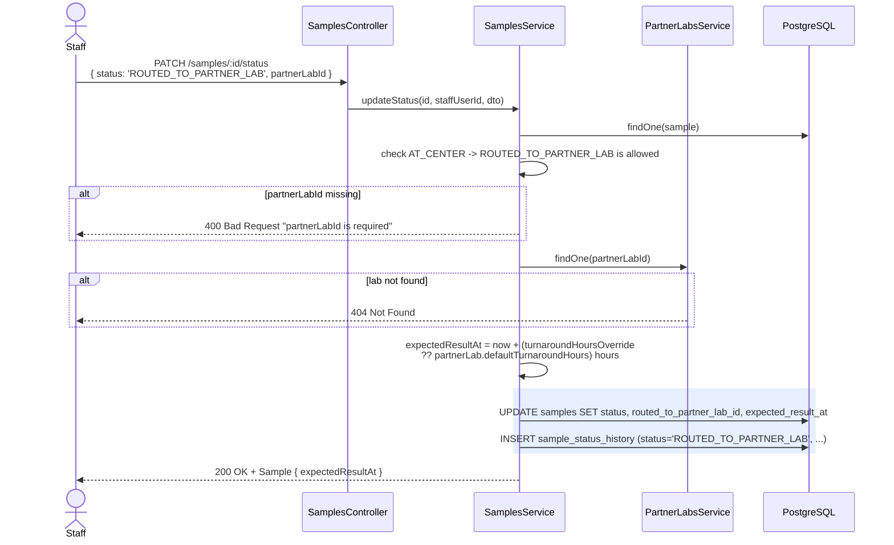
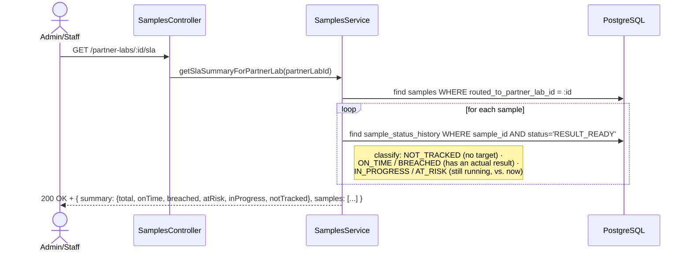

# Partner-lab routing + SLA tracking

**Pairs with:** [`flows/drawio/08-partner-labs-trace.drawio`](./drawio/08-partner-labs-trace.drawio)

## Objective

When a sample is routed to an outside lab, record a real turnaround
target (`expectedResultAt`) at that exact moment — then let staff answer
"is this lab keeping up?" later purely by **reading data that already
exists**, with no separate SLA-tracking table or background job. Picks up
where [`09-sample-lifecycle-flow.md`](./09-sample-lifecycle-flow.md) left
the `AT_CENTER → ROUTED_TO_PARTNER_LAB` branch.

## Classes / entities / DTOs used

| Layer | Name | Role |
|---|---|---|
| Controller | `SamplesController` | reuses the same `PATCH /samples/:id/status` endpoint from step 5 for routing, **and** `GET /partner-labs/:partnerLabId/sla` — both live on this controller, not on `PartnerLabsController`, despite the route's URL |
| Service | `SamplesService` | `updateStatus()` (sets the target) and `getSlaSummaryForPartnerLab()` (reads it back) |
| Service | `PartnerLabsService` | owns `partner_labs`; looked up for its `defaultTurnaroundHours` |
| DTO | `UpdateSampleStatusDto` | same DTO as step 5, with `partnerLabId` + optional `turnaroundHoursOverride` used only for this transition |
| Entity | `PartnerLab` | `@Entity('partner_labs')` — `name`, `city`, `contactPhone`, `defaultTurnaroundHours` |
| Entity | `Sample` | `expectedResultAt` and `routedToPartnerLabId` columns are set here |
| Entity | `SampleStatusHistory` | the `RESULT_READY` row is what "actual" completion time is read from later |

## Tables used

| Table | Operations |
|---|---|
| `samples` | `UPDATE` (status, `routed_to_partner_lab_id`, `expected_result_at`) · `SELECT WHERE routed_to_partner_lab_id = :id` (SLA summary) |
| `partner_labs` | `SELECT` (to read `defaultTurnaroundHours` when no override is given) |
| `sample_status_history` | `INSERT` (the routing transition itself) · `SELECT WHERE status = 'RESULT_READY'` (SLA summary reads the actual completion time from here) |

**No new table exists for SLA tracking** — see "Nothing new is stored"
below.

## Conditions checked

| # | Condition | Outcome |
|---|---|---|
| 1 | Routing (`status: ROUTED_TO_PARTNER_LAB`) without `partnerLabId` | `400 Bad Request` "partnerLabId is required" |
| 2 | `partnerLabId` doesn't resolve to a real lab | `404 Not Found` |
| 3 | `expectedResultAt` computed as `now + (turnaroundHoursOverride ?? partnerLab.defaultTurnaroundHours)` hours | not a rejection — the actual SLA target being set |
| 4 | The `AT_CENTER → ROUTED_TO_PARTNER_LAB` transition itself is still checked against `ALLOWED_TRANSITIONS` (step 5's rule) | `400 Bad Request` if the sample isn't currently `AT_CENTER` |

### SLA classification — read-time decision tree

## How it flows

### Routing a sample (setting the SLA target)

### Reading the SLA summary

## Nothing new is stored

`expectedResultAt` lives on `Sample` (set once, at routing time) and the
"actual" side is read straight out of `SampleStatusHistory`'s
`RESULT_READY` row, which step 5 was already writing. SLA tracking is a
**read-time computation** over data that already existed before this step
was built — nothing here needed a migration.
