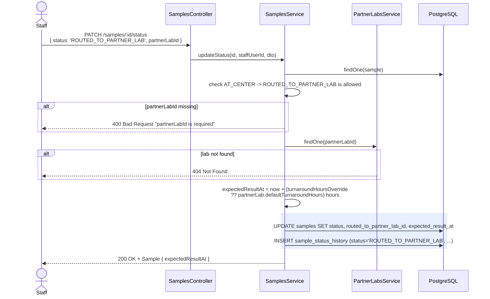
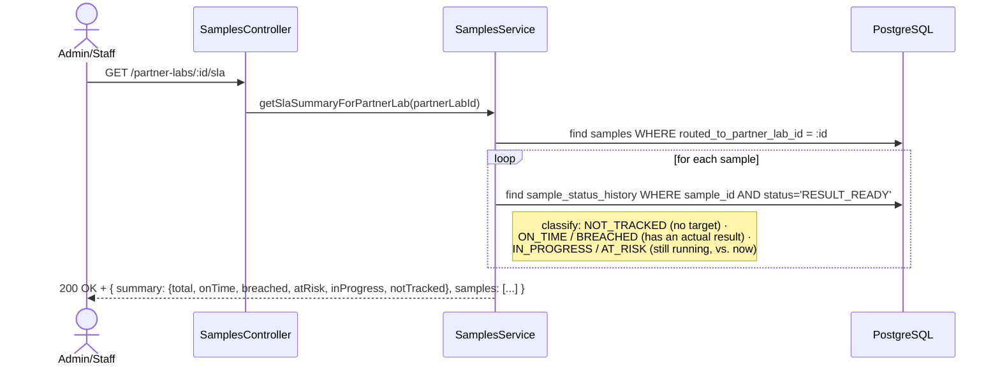
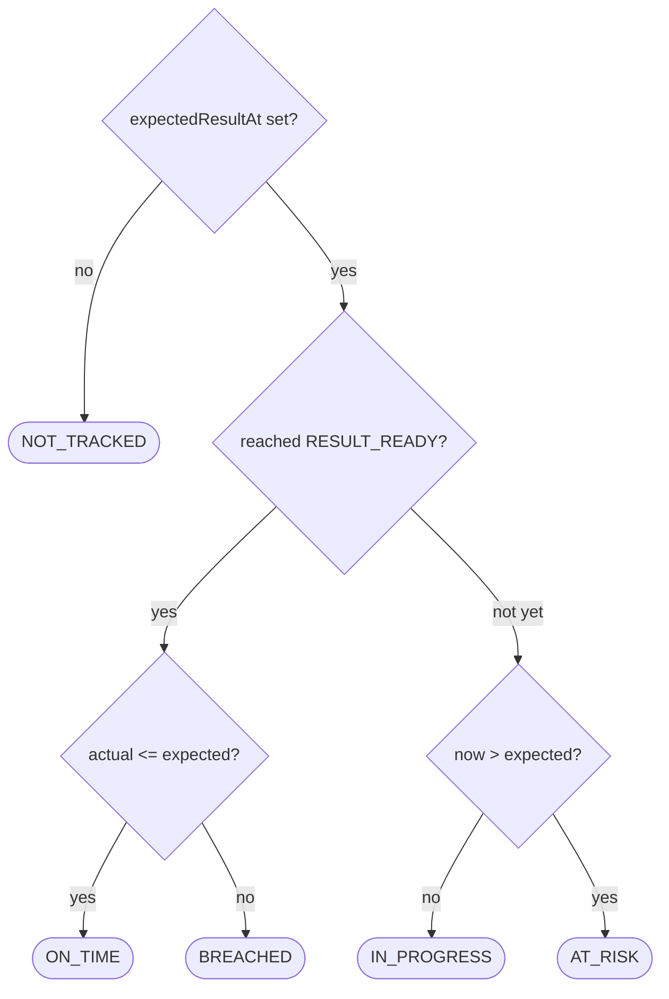

# Partner-lab routing + SLA tracking

Picks up where [`09-sample-lifecycle-flow.md`](./09-sample-lifecycle-flow.md)
left the `AT_CENTER → ROUTED_TO_PARTNER_LAB` branch — what actually
happens at that step, and how "is this lab keeping up" gets answered
later.

## Routing a sample (setting the SLA target)

## Reading the SLA summary

## Classification

Nothing here is a new stored column — `expectedResultAt` lives on
`Sample` (set once, at routing time) and the "actual" side is read
straight out of `SampleStatusHistory`'s `RESULT_READY` row, which step 5
was already writing. SLA tracking is a read-time computation over data
that already exists.
