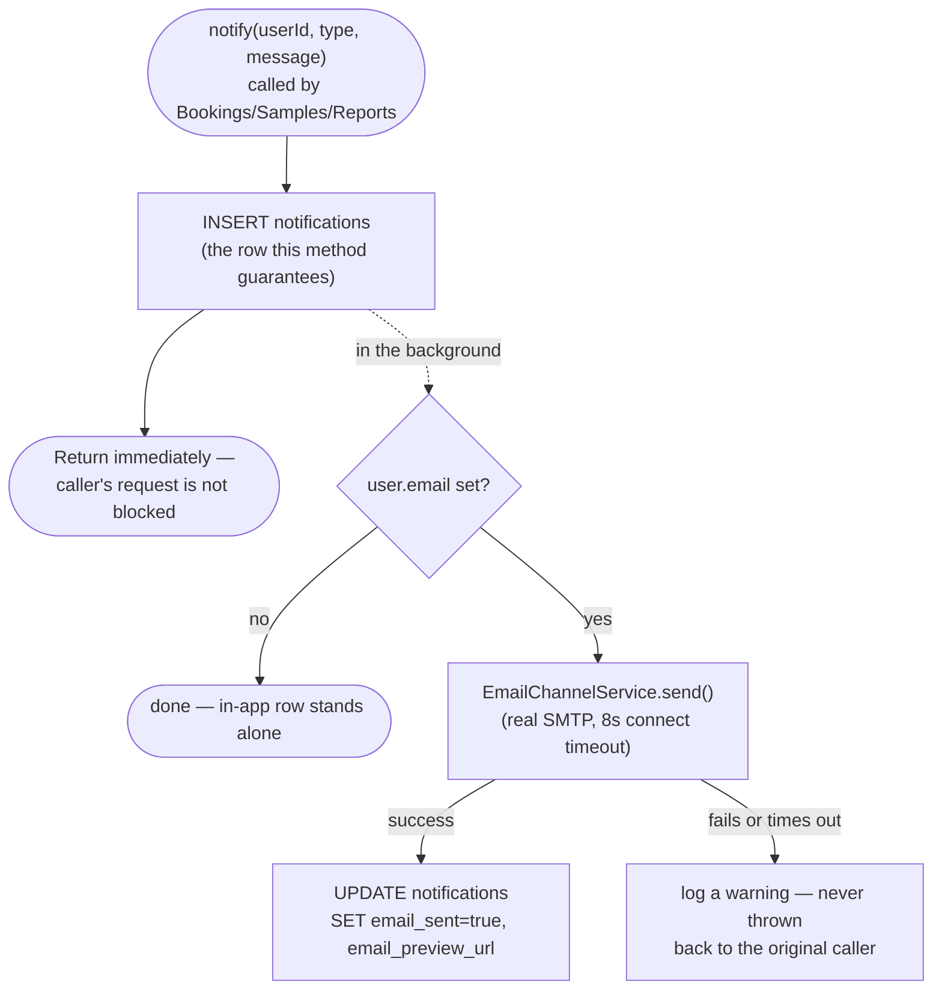
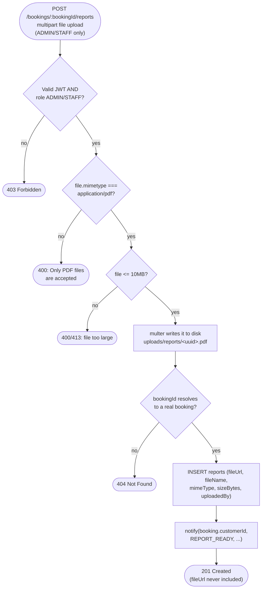
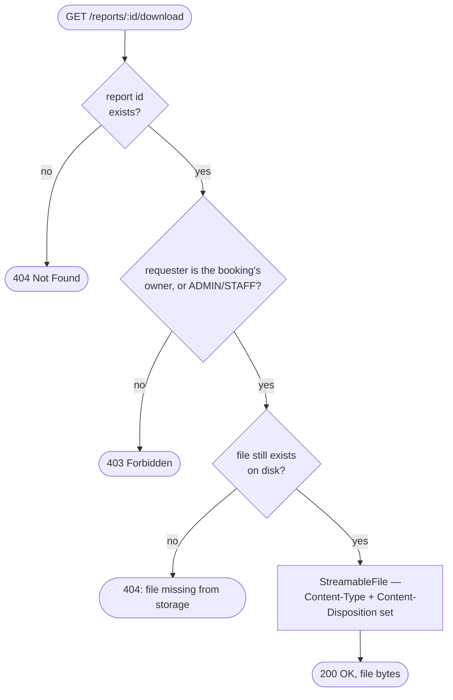
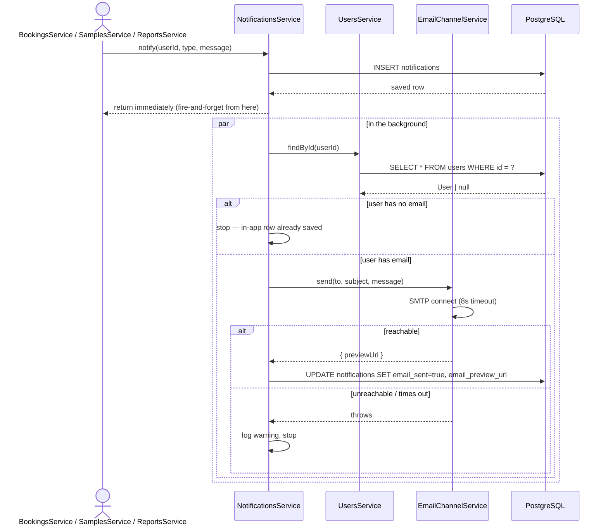

# Notifications + report upload/download

**Pairs with:** no `drawio/` trace yet — see "What's missing" at the
bottom.

## Objective

Give every customer a real, always-on record of what's happening to
their booking (booked, sample collected, results ready, report
uploaded) without needing a paid SMS/push provider to prove it works,
and let staff attach a PDF report to a booking that only its owner (or
staff/admin) can download. In-app notifications are the one channel that
always works; email is a real, working second channel (not faked) that
degrades gracefully when there's no address on file or the SMTP call
fails.

## Classes / entities / DTOs used

| Layer | Name | Role |
|---|---|---|
| Controller | `NotificationsController` | `GET /notifications/mine`, `PATCH /notifications/:id/read` |
| Controller | `ReportsController` | `POST /bookings/:bookingId/reports`, `GET /bookings/:bookingId/reports`, `GET /reports/:id/download` |
| Service | `NotificationsService` | `notify()` — the one method every other module calls; owns `notifications` |
| Service | `EmailChannelService` | wraps Nodemailer; real SMTP if `SMTP_HOST` is set, a free Ethereal test account otherwise |
| Service | `ReportsService` | owns `reports`; calls `BookingsService` for ownership checks and `NotificationsService` after a successful upload |
| Entity | `Notification` | `@Entity('notifications')` |
| Entity | `Report` | `@Entity('reports')` — extends `schema.sql`'s original 4 columns with `fileName`/`mimeType`/`sizeBytes`/`uploadedBy` |
| Enum | `NotificationType` | `BOOKING_CREATED \| SAMPLE_COLLECTED \| RESULT_READY \| REPORT_READY` |
| Config | `reportMulterOptions` (`reports.multer-options.ts`) | disk storage under `apps/api/uploads/reports/`, PDF-only `fileFilter`, 10MB `limits` |

**Callers, not owned by this step:** `BookingsService.create()`,
`SamplesService.updateStatus()` — each calls
`NotificationsService.notify()` at exactly the milestones a customer
cares about (see "Conditions checked").

## Tables used

| Table | Operations |
|---|---|
| `notifications` | `INSERT` (every `notify()` call) · `UPDATE` (`emailSent`/`emailPreviewUrl` once delivery finishes, `readAt` on mark-read) · `SELECT WHERE user_id = ?` |
| `reports` | `INSERT` (upload) · `SELECT WHERE booking_id = ?` (list) · `SELECT WHERE id = ?` (download) |
| `bookings` | `SELECT` (read-only — ownership checks and to get `customerId` to notify) |
| `users` | `SELECT` (read-only — looking up the recipient's `email`, if any) |

No table any other step owns is ever written to from here.

## Conditions checked

| # | Condition | Outcome |
|---|---|---|
| 1 | `notify()`: is the in-app row ever skipped? | **No.** It's written first, unconditionally — nothing downstream can prevent it. |
| 2 | `notify()`: recipient has no `email` on file | email step is skipped silently; the in-app notification already exists |
| 3 | `notify()`: email send throws or times out | caught and logged as a warning; never thrown back to the caller |
| 4 | Which sample-status transitions actually notify? | only `COLLECTED` and `RESULT_READY` — not every intermediate `IN_TRANSIT_TO_CENTER`/`AT_CENTER`/`IN_HOUSE_PROCESSING` step |
| 5 | Report upload: role isn't `ADMIN`/`STAFF` | `403 Forbidden` |
| 6 | Report upload: file isn't `application/pdf` | `400 Bad Request` "Only PDF files are accepted" |
| 7 | Report upload: file exceeds 10MB | rejected by multer's `limits.fileSize` |
| 8 | Report upload: `bookingId` doesn't resolve to a real booking | `404 Not Found` |
| 9 | Report list/download: requester isn't the booking's owner and isn't `ADMIN`/`STAFF` | `403 Forbidden` (same `BookingsService.findOneForUser()` check `SamplesModule` reuses) |
| 10 | Report download: the id resolves to a row, but the file is missing on disk | `404 Not Found` "Report file is missing from storage" |
| 11 | Report responses: is the raw disk path ever returned to a client? | **Never** — `ReportsService.toPublic()` strips `fileUrl`; the only way to get bytes is `/reports/:id/download` |

## How it flows

### Sending a notification — start to end

### Uploading a report — start to end

### Downloading a report — start to end

## Sequence detail (which service calls which)

## A real bug this step found (worth reading)

The first version of `notify()` `await`-ed email delivery inline, inside
a `try/catch` — reasoning that any failure would be caught and the
caller would never see an exception. That held for *errors*, but not for
*latency*: in an environment with no outbound raw-SMTP route (only
HTTPS egress), a single `POST /bookings` call took **~2 minutes** to
return, because Nodemailer's default connection timeout is that long,
and the `try/catch` only stops an eventual error from propagating — it
does nothing about how long getting there takes. Confirmed with `time
curl`: ~120s before the fix, 29ms after. Fixed by making email delivery
genuinely fire-and-forget (`notify()` returns as soon as the in-app row
is saved) and setting explicit 8-second timeouts on the SMTP transport
as a second layer of defense. The lesson, not just for this codebase: a
`try/catch` around an `await` only protects against the call throwing —
it does nothing to bound how long that `await` takes to settle.

## What's missing

- **No `drawio/` trace diagram for this step yet** — every other step
  has a request-trace `.drawio`/`.svg` pair; this one doesn't, since it
  was built directly against this flow doc's template instead.
  `flows/drawio/generate_diagrams.py` would need a
  `NOTIFICATIONS_ENDPOINTS`/`REPORTS_ENDPOINTS` list added, the same way
  `SAMPLES_ENDPOINTS`/`PARTNER_LABS_ENDPOINTS` were for steps 5–6.
- **SMS and push are not implemented**, only documented as an extension
  point (see `EmailChannelService`'s file comment and
  `docs/step-10-notifications-reports.md`) — both need paid (Twilio) or
  platform-specific (Firebase Cloud Messaging) credentials this
  environment doesn't have.
- **Email delivery itself is unverified in this environment** — the
  code path is real and correct (confirmed via the timing fix above),
  but this sandbox's network has no outbound raw-SMTP route, so no
  actual email — Ethereal or real SMTP — has been observed to arrive
  anywhere from here. It needs a real network to confirm end-to-end.
