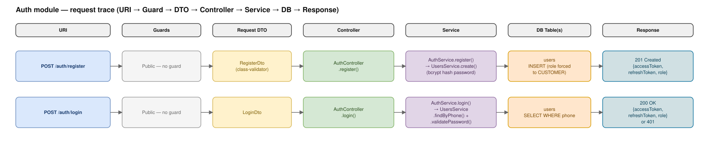
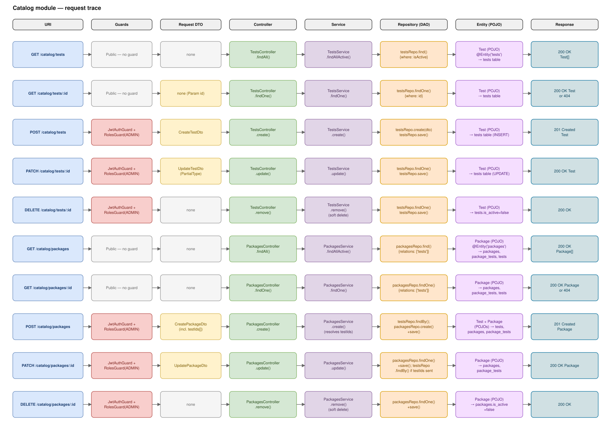
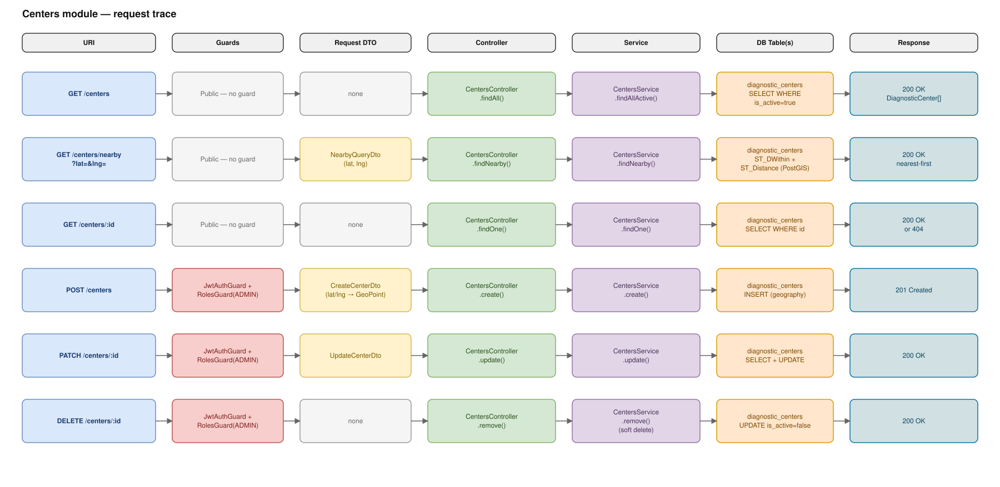
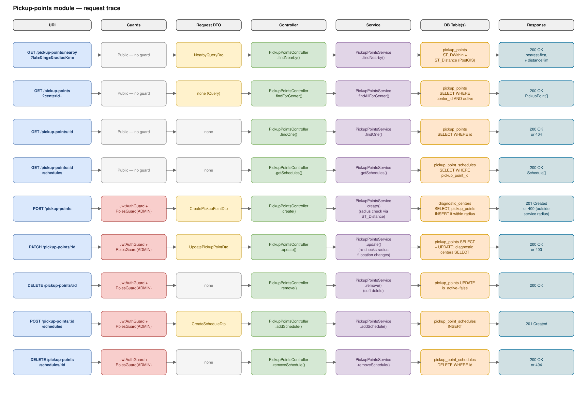
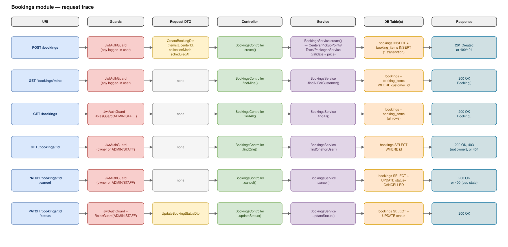
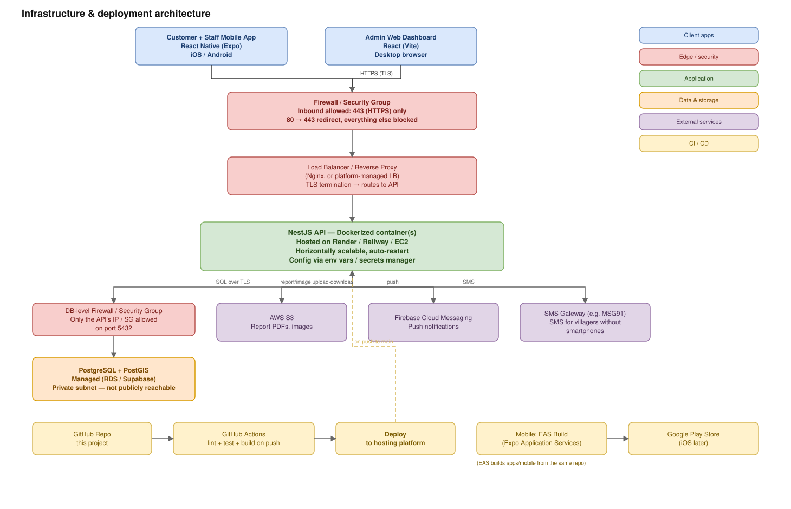

# Editable diagrams (draw.io / diagrams.net)

The [`../`](../) folder has quick-reference diagrams as Mermaid (GitHub
renders those inline automatically, but you can't drag boxes around).
**These are the same information as actual editable draw.io files** —
open one, drag boxes, change a label, add a box, save — exactly like
working in [diagrams.net](https://app.diagrams.net) (formerly draw.io),
because that's exactly what these are.

Every `.drawio` file has a matching `.svg` right next to it with the
identical layout, so you can see it below without opening anything.
GitHub doesn't render `.drawio` inline, which is the only reason the SVG
twin exists — click through to the `.drawio` the moment you want to
change something.

## How to open and edit a `.drawio` file

- **Browser, no install** — go to [app.diagrams.net](https://app.diagrams.net),
  choose "Open Existing Diagram", and select the `.drawio` file (downloaded
  from GitHub, or dragged in directly).
- **VS Code** — install the **Draw.io Integration** extension
  (`hediet.vscode-drawio`), then just open the `.drawio` file — it edits
  in place, right in the editor.
- **Desktop app** — [draw.io desktop](https://github.com/jgraph/drawio-desktop/releases)
  opens `.drawio` files directly.

Once you've changed a diagram, save it (still `.drawio`) and it'll show
up as a normal file diff. If you also want the `.svg` preview to match,
either re-export it from draw.io (File → Export as → SVG, overwrite the
same filename) or regenerate everything from source — see
[Regenerating from code](#regenerating-from-code) below.

## Request-trace diagrams

Each one answers exactly this: *"this URI → this guard → this DTO → this
controller method → this service method → this repository call → this
entity/table → this response."* One row per endpoint, same eight columns
every time, colored by layer so you can scan down a column (e.g. every
DTO) as easily as across a row (one endpoint's full path).

If you're coming from Spring Boot: this is the same
`Controller → Service → DAO → POJO` layering you already know, just with
two differences that are naming/timing, not structural —

- **Request DTO gets its own column, before the Controller.** In Spring,
  `@Valid @RequestBody SomeDto dto` in the controller method signature
  means "bind + validate" happens *as* the controller method is called —
  it reads like one step. NestJS pulls that same job out into its own
  named pipeline stage (a `Pipe`), which runs and finishes *before* the
  controller method executes — same job, same moment, just drawn as its
  own box because NestJS's request pipeline
  (`Guards → Interceptors → Pipes → Handler`) makes it an explicit stage.
- **"Repository (DAO)" + "Entity (POJO)" are TypeORM's names for the same
  two things Spring calls DAO and POJO.** `Repository<Entity>` (injected
  via `@InjectRepository`) is the DAO; an `@Entity()`-decorated class
  (`User`, `Test`, `Booking`, ...) is the POJO. The one real difference:
  this codebase injects the Repository straight into the Service, with no
  separate hand-written DAO class in between — which is the normal
  NestJS/TypeORM idiom, not a shortcut specific to this project.

| | |
|---|---|
| **Auth** | [`01-auth-trace.drawio`](./01-auth-trace.drawio) |
|  | |
| **Catalog** (tests + packages) | [`02-catalog-trace.drawio`](./02-catalog-trace.drawio) |
|  | |
| **Centers** | [`03-centers-trace.drawio`](./03-centers-trace.drawio) |
|  | |
| **Pickup points** | [`04-pickup-points-trace.drawio`](./04-pickup-points-trace.drawio) |
|  | |
| **Bookings** | [`05-bookings-trace.drawio`](./05-bookings-trace.drawio) |
|  | |

**Column color key:** URI = blue · Guards = red (gray if the route is
public) · Request DTO = yellow (gray if none) · Controller = green ·
Service = purple · Repository (DAO) = orange · Entity (POJO) = violet ·
Response = teal.

## Infrastructure & deployment

Where each piece actually runs, what's allowed to talk to what, and how
a code push turns into a deployed change — client apps, firewall, load
balancer, the API containers, the database's own network restrictions,
external services (S3, push, SMS), and the CI/CD + mobile build pipeline.

[`06-infrastructure-deployment.drawio`](./06-infrastructure-deployment.drawio)



This reflects the hosting plan in [`ARCHITECTURE.md`](../../ARCHITECTURE.md)
(Render/Railway/EC2 + managed Postgres + EAS Build) — nothing here is
provisioned yet, it's the target shape once step 11 (Dockerize + CI +
deployment guide) happens.

## Regenerating from code

[`generate_diagrams.py`](./generate_diagrams.py) builds every `.drawio` +
`.svg` pair in this folder from plain Python data (one dict per endpoint —
method, URI, guard, DTO, controller call, service call, repository call,
entity/table, response). When an endpoint's route, guard, or DTO changes,
or a new one is added, update the matching list in that script and
re-run it:

```bash
python3 flows/drawio/generate_diagrams.py
```

This keeps the request-trace diagrams from silently drifting out of sync
with the actual code — but it's optional: you can just as easily hand-edit
the `.drawio` files in the app directly. Regenerating will overwrite
manual edits to the files it produces, so if you've hand-tweaked a layout
you want to keep, don't re-run it (or copy your changes into the script
first).
